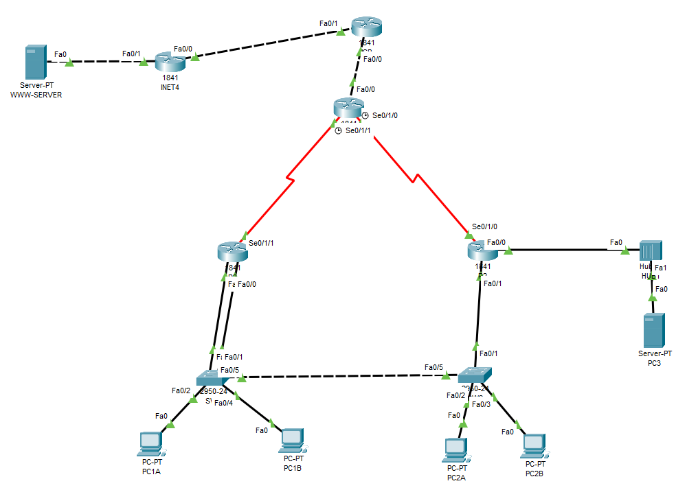
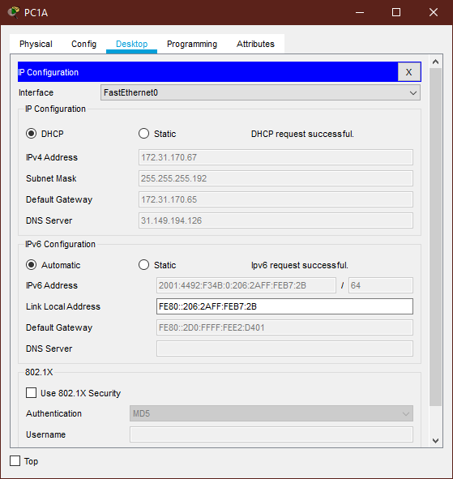
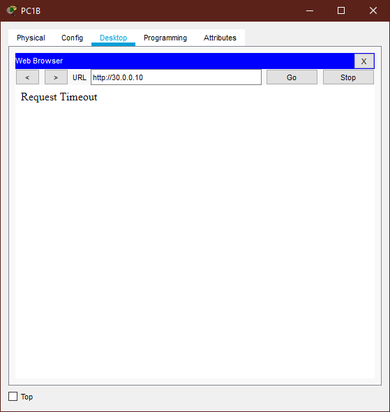
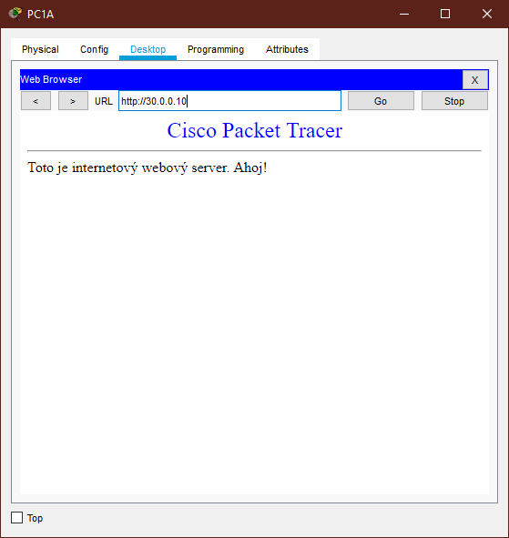
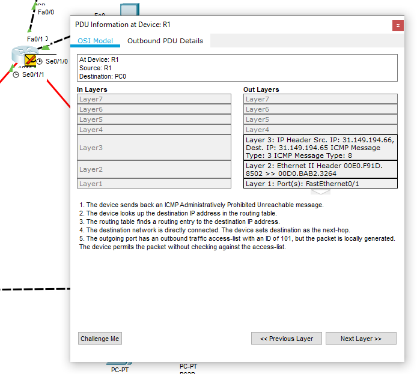

# Praktická část 2

## Aktuální topologie v PT



## 1. Výpisy konfigurace aktivních prvků

### INET4 (Součást infrastruktury za ISP routerem - pro testování)
```
Building configuration...

Current configuration : 687 bytes
!
version 12.4
no service timestamps log datetime msec
no service timestamps debug datetime msec
no service password-encryption
!
hostname INET4
!
!
!
enable password cisco
!
!
!
!
!
!
ip cef
no ipv6 cef
!
!
!
!
!
!
!
!
!
!
!
!
spanning-tree mode pvst
!
!
!
!
!
!
interface FastEthernet0/0
 ip address 40.0.0.11 255.255.255.240
 duplex auto
 speed auto
!
interface FastEthernet0/1
 ip address 30.0.0.1 255.255.255.240
 duplex auto
 speed auto
!
interface Vlan1
 no ip address
 shutdown
!
ip classless
ip route 0.0.0.0 0.0.0.0 20.0.0.1 
ip route 0.0.0.0 0.0.0.0 40.0.0.1 
!
ip flow-export version 9
!
!
!
!
!
!
!
!
line con 0
!
line aux 0
!
line vty 0 4
 password cisco
 login
!
!
!
end
```

### ISP Router
```
Building configuration...

Current configuration : 933 bytes
!
version 12.4
no service timestamps log datetime msec
no service timestamps debug datetime msec
no service password-encryption
!
hostname ISP
!
!
!
!
!
!
!
!
ip cef
ipv6 unicast-routing
!
no ipv6 cef
!
!
!
!
!
!
!
!
!
!
!
!
spanning-tree mode pvst
!
!
!
!
!
!
interface FastEthernet0/0
 description pripojeni do firemni site
 ip address 10.0.0.1 255.255.255.252
 duplex auto
 speed auto
 ipv6 address 2001:4492:F34B:5::1/64
!
interface FastEthernet0/1
 ip address 40.0.0.1 255.255.255.240
 duplex auto
 speed auto
!
interface Serial0/1/0
 no ip address
 clock rate 2000000
!
interface Serial0/1/1
 no ip address
 clock rate 2000000
!
interface Vlan1
 no ip address
 shutdown
!
ip classless
ip route 31.149.194.0 255.255.254.0 10.0.0.2 
ip route 30.0.0.0 255.255.255.240 40.0.0.11 
!
ip flow-export version 9
!
ipv6 route 2001:4492:F34B::/48 2001:4492:F34B:5::2
!
!
!
!
!
!
!
line con 0
!
line aux 0
!
line vty 0 4
 login
!
!
!
end
```

### R1
```
Building configuration...

Current configuration : 2778 bytes
!
version 12.4
no service timestamps log datetime msec
no service timestamps debug datetime msec
no service password-encryption
!
hostname R1
!
!
!
!
!
!
!
!
no ip cef
ipv6 unicast-routing
!
no ipv6 cef
!
!
!
!
!
!
!
!
!
!
!
!
spanning-tree mode pvst
!
!
!
!
!
!
interface FastEthernet0/0
 description pripojeni do internetu (isp)
 ip address 10.0.0.2 255.255.255.252
 ip access-group 102 in
 ip access-group 101 out
 ip nat outside
 duplex auto
 speed auto
 ipv6 address 2001:4492:F34B:5::2/64
!
interface FastEthernet0/1
 no ip address
 duplex auto
 speed auto
 shutdown
!
interface Serial0/1/0
 description propojeni s routerem R2
 ip address 31.149.194.161 255.255.255.252
 ip nat inside
 ipv6 address 2001:4492:F34B:3::1/64
 ipv6 ospf 2 area 0
 clock rate 64000
!
interface Serial0/1/1
 description propojeni s routerem R3
 ip address 31.149.194.165 255.255.255.252
 ip nat inside
 ipv6 address 2001:4492:F34B:4::1/64
 ipv6 ospf 2 area 0
 clock rate 64000
!
interface Vlan1
 no ip address
 shutdown
!
router ospf 1
 log-adjacency-changes
 passive-interface FastEthernet0/0
 network 31.149.194.160 0.0.0.3 area 0
 network 31.149.194.164 0.0.0.3 area 0
 default-information originate
!
ipv6 router ospf 2
 default-information originate
 log-adjacency-changes
 redistribute connected metric 1 
 passive-interface FastEthernet0/0
!
ip nat pool vlan_A_NAT 31.149.194.129 31.149.194.158 netmask 255.255.255.224
ip nat inside source list 1 interface FastEthernet0/0 overload
ip classless
ip route 0.0.0.0 0.0.0.0 10.0.0.1 
!
ip flow-export version 9
!
ipv6 route ::/0 2001:4492:F34B:5::1
!
access-list 1 permit 172.31.170.64 0.0.0.63
access-list 101 permit tcp 31.149.194.64 0.0.0.63 host 40.0.0.11 eq telnet
access-list 101 deny tcp 31.149.194.0 0.0.0.63 host 30.0.0.10 eq www
access-list 101 permit tcp any any eq www
access-list 101 permit udp any any eq domain
access-list 101 permit udp host 31.149.194.126 eq domain any
access-list 101 permit icmp any any echo
access-list 101 permit icmp host 31.149.194.126 any echo-reply
access-list 101 permit icmp host 10.0.0.2 any echo-reply
access-list 101 deny ip 172.31.170.64 0.0.0.63 any
access-list 102 permit tcp host 40.0.0.11 eq telnet 31.149.194.64 0.0.0.63 established
access-list 102 deny tcp host 30.0.0.10 eq www 31.149.194.0 0.0.0.63
access-list 102 permit tcp any eq www any established
access-list 102 permit udp any eq domain any
access-list 102 permit udp any host 31.149.194.126 eq domain
access-list 102 permit icmp any any echo-reply
access-list 102 permit icmp any host 31.149.194.126 echo
access-list 102 permit icmp any host 10.0.0.2 echo
access-list 102 deny ip 172.31.170.64 0.0.0.63 any
access-list 102 deny ip 31.149.194.0 0.0.1.255 any
!
!
!
!
!
!
line con 0
!
line aux 0
!
line vty 0 4
 login
!
!
!
end
```

### R2
```
Building configuration...

Current configuration : 1494 bytes
!
version 12.4
no service timestamps log datetime msec
no service timestamps debug datetime msec
no service password-encryption
!
hostname R2
!
!
!
!
ip dhcp excluded-address 172.31.170.65 172.31.170.66
!
ip dhcp pool vlanA
 network 172.31.170.64 255.255.255.192
 default-router 172.31.170.65
 dns-server 31.149.194.126
!
!
!
no ip cef
ipv6 unicast-routing
!
no ipv6 cef
!
!
!
!
!
!
!
!
!
!
!
!
spanning-tree mode pvst
!
!
!
!
!
!
interface FastEthernet0/0
 description propojeni do segmentu S1
 ip address 31.149.194.65 255.255.255.192
 duplex auto
 speed auto
 ipv6 address 2001:4492:F34B:2::1/64
 ipv6 ospf 2 area 0
!
interface FastEthernet0/1
 description propojeni do VLAN A
 ip address 172.31.170.65 255.255.255.192
 duplex auto
 speed auto
 ipv6 address 2001:4492:F34B::1/64
 ipv6 ospf 2 area 0
!
interface Serial0/1/0
 description propojeni s routerem R1
 ip address 31.149.194.162 255.255.255.252
 ipv6 address 2001:4492:F34B:3::2/64
 ipv6 ospf 2 area 0
!
interface Serial0/1/1
 no ip address
 clock rate 2000000
 shutdown
!
interface Vlan1
 no ip address
 shutdown
!
router ospf 1
 log-adjacency-changes
 passive-interface FastEthernet0/0
 network 31.149.194.160 0.0.0.3 area 0
 network 31.149.194.64 0.0.0.63 area 0
 network 172.31.170.64 0.0.0.63 area 0
!
ipv6 router ospf 2
 log-adjacency-changes
 redistribute connected metric 1 
 passive-interface FastEthernet0/0
!
ip classless
!
ip flow-export version 9
!
!
!
!
!
!
!
!
line con 0
!
line aux 0
!
line vty 0 4
 login
!
!
!
end
```

### R3
```
Building configuration...

Current configuration : 1249 bytes
!
version 12.4
no service timestamps log datetime msec
no service timestamps debug datetime msec
no service password-encryption
!
hostname R3
!
!
!
!
!
!
!
!
no ip cef
ipv6 unicast-routing
!
no ipv6 cef
!
!
!
!
!
!
!
!
!
!
!
!
spanning-tree mode pvst
!
!
!
!
!
!
interface FastEthernet0/0
 description propojeni do VLAN A
 ip address 172.31.170.66 255.255.255.192
 duplex auto
 speed auto
 ipv6 address 2001:4492:F34B::2/64
 ipv6 ospf 2 area 0
!
interface FastEthernet0/1
 description propojeni do VLAN B
 ip address 31.149.194.1 255.255.255.192
 duplex auto
 speed auto
 ipv6 address 2001:4492:F34B:1::1/64
 ipv6 ospf 2 area 0
!
interface Serial0/1/0
 description propojeni s routerem R1
 no ip address
 clock rate 2000000
 shutdown
!
interface Serial0/1/1
 ip address 31.149.194.166 255.255.255.252
 ipv6 address 2001:4492:F34B:4::2/64
 ipv6 ospf 2 area 0
!
interface Vlan1
 no ip address
 shutdown
!
router ospf 1
 log-adjacency-changes
 network 31.149.194.164 0.0.0.3 area 0
 network 172.31.170.64 0.0.0.63 area 0
 network 31.149.194.0 0.0.0.63 area 0
!
ipv6 router ospf 2
 log-adjacency-changes
 redistribute connected metric 1 
!
ip classless
!
ip flow-export version 9
!
!
!
!
!
!
!
!
line con 0
!
line aux 0
!
line vty 0 4
 login
!
!
!
end
```

### SW1
```
Building configuration...

Current configuration : 1540 bytes
!
version 12.1
no service timestamps log datetime msec
no service timestamps debug datetime msec
no service password-encryption
!
hostname SW1
!
!
!
!
vtp mode transparent
!
!
!
spanning-tree mode pvst
spanning-tree extend system-id
!
vlan 24
 name A
!
vlan 97
 name B
!
interface FastEthernet0/1
 description propojeni s routerem R3 na VLAN A
 switchport access vlan 24
 switchport mode access
!
interface FastEthernet0/2
 description PC1A na VLAN A
 switchport access vlan 24
 switchport mode access
!
interface FastEthernet0/3
 description propojeni s routerem R3 na VLAN B
 switchport access vlan 97
 switchport mode access
!
interface FastEthernet0/4
 description PC1B na VLAN A
 switchport access vlan 97
 switchport mode access
!
interface FastEthernet0/5
 description trunk mezi SW1 a SW2 (VLAN A a VLAN B)
 switchport trunk allowed vlan 24,97
 switchport mode trunk
!
interface FastEthernet0/6
!
interface FastEthernet0/7
!
interface FastEthernet0/8
!
interface FastEthernet0/9
!
interface FastEthernet0/10
!
interface FastEthernet0/11
!
interface FastEthernet0/12
!
interface FastEthernet0/13
!
interface FastEthernet0/14
!
interface FastEthernet0/15
!
interface FastEthernet0/16
!
interface FastEthernet0/17
!
interface FastEthernet0/18
!
interface FastEthernet0/19
!
interface FastEthernet0/20
!
interface FastEthernet0/21
!
interface FastEthernet0/22
!
interface FastEthernet0/23
!
interface FastEthernet0/24
!
interface Vlan1
 no ip address
 shutdown
!
!
!
!
line con 0
!
line vty 0 4
 login
line vty 5 15
 login
!
!
!
!
end
```

### SW2
```
Building configuration...

Current configuration : 1442 bytes
!
version 12.1
no service timestamps log datetime msec
no service timestamps debug datetime msec
no service password-encryption
!
hostname SW2
!
!
!
!
vtp mode transparent
!
!
!
spanning-tree mode pvst
spanning-tree extend system-id
!
vlan 24
 name A
!
vlan 97
 name B
!
interface FastEthernet0/1
 description propojeni s routerem R2 na VLAN A
 switchport access vlan 24
 switchport mode access
!
interface FastEthernet0/2
 description PC2A na VLAN A
 switchport access vlan 24
 switchport mode access
!
interface FastEthernet0/3
 description PC2B na VLAN B
 switchport access vlan 97
 switchport mode access
!
interface FastEthernet0/4
!
interface FastEthernet0/5
 description trunk mezi SW1 a SW2 (VLAN A a VLAN B)
 switchport trunk allowed vlan 24,97
 switchport mode trunk
!
interface FastEthernet0/6
!
interface FastEthernet0/7
!
interface FastEthernet0/8
!
interface FastEthernet0/9
!
interface FastEthernet0/10
!
interface FastEthernet0/11
!
interface FastEthernet0/12
!
interface FastEthernet0/13
!
interface FastEthernet0/14
!
interface FastEthernet0/15
!
interface FastEthernet0/16
!
interface FastEthernet0/17
!
interface FastEthernet0/18
!
interface FastEthernet0/19
!
interface FastEthernet0/20
!
interface FastEthernet0/21
!
interface FastEthernet0/22
!
interface FastEthernet0/23
!
interface FastEthernet0/24
!
interface Vlan1
 no ip address
 shutdown
!
!
!
!
line con 0
!
line vty 0 4
 login
line vty 5 15
 login
!
!
!
!
end
```

## 2. Konfigurace bind9

(Konfigurační soubory jsou v samostatném adresáři)

## 3. Screenshot dokládající úspěšné DHCP přiřazení



## 4. Test běžného a reverzního překladu na DNS serveru

(Hostname linux boxu je dost specifický, protože je to na VPS zřízené pro tento jeden účel)

### Běžný překlad na adresu DNS serveru
```
root@ubuntu-bind9:~# host ns.mohje.isp.cz
ns.mohje.isp.cz has address 31.149.194.126
ns.mohje.isp.cz has IPv6 address 2001:4492:f34b:2:ffff:ffff:ffff:ffff
```

### Reverzní překlad adresy DNS serveru
```
root@ubuntu-bind9:~# host 31.149.194.126
126.194.149.31.in-addr.arpa domain name pointer ns.mohje.isp.cz.
```

### Běžný překlad na rozhraní fa0/0 routeru R2
```
root@ubuntu-bind9:~# host R-2-fa00.mohje.isp.cz
R-2-fa00.mohje.isp.cz has address 31.149.194.65
R-2-fa00.mohje.isp.cz has IPv6 address 2001:4492:f34b:2::1
```

### Reverzní překlad adresy rozhraní fa0/0 routeru R2
```
root@ubuntu-bind9:~# host 31.149.194.65
65.194.149.31.in-addr.arpa domain name pointer R-2-fa00.mohje.isp.cz.
```

## 5. Test funkčnosti pravidel firewallu pro jednotlivá pravidla

### Ze segmentu S1 se lze připojit na Telnet server 40.0.0.11 

- PC3 -> INET4

```
Packet Tracer SERVER Command Line 1.0
C:\>telnet 40.0.0.11
Trying 40.0.0.11 ...Open


User Access Verification

Password: 
INET4>
```

### Stanice na segmentu VLAN B nesmějí na WWW server 30.0.0.10, jinak smí celá firma k WWW serverům na Internetu přistupovat volně

- PC1B -> WWW-SERVER



- PC1A -> WWW-SERVER



### DNS dotazy směrem ven a odpovědi zvnějšku jsou propouštěny volně, DNS dotazy dovnitř a příslušné odpovědi pouze na adresu vašeho firemního DNS serveru

- DNS dotaz zvenku na server ve vnitřní síti (WWW-SERVER -> PC3)

```
C:\>ping R-1-se010

Pinging 31.149.194.161 with 32 bytes of data:

Reply from 10.0.0.2: Destination host unreachable.
Reply from 10.0.0.2: Destination host unreachable.
Reply from 10.0.0.2: Destination host unreachable.
Reply from 10.0.0.2: Destination host unreachable.

Ping statistics for 31.149.194.161:
Packets: Sent = 4, Received = 0, Lost = 4 (100% loss),
```

### Stanicím a směrovačům ve firmě je dovolen ping (ICMP echo request) kamkoli do Internetu, stanice firmy však nemají být ohrožovány pokusy o ping zvnějšku (mimo DNS serveru, na který ping zvnějšku prochází). Na vnější rozhraní směrovače R1 je žádost o ping také povolena

- PC1B -> WWW-SERVER

```
Packet Tracer PC Command Line 1.0
C:\>ping 30.0.0.10

Pinging 30.0.0.10 with 32 bytes of data:

Reply from 30.0.0.10: bytes=32 time=1ms TTL=124
Reply from 30.0.0.10: bytes=32 time=14ms TTL=124
Reply from 30.0.0.10: bytes=32 time=1ms TTL=124
Reply from 30.0.0.10: bytes=32 time=13ms TTL=124

Ping statistics for 30.0.0.10:
    Packets: Sent = 4, Received = 4, Lost = 0 (0% loss),
Approximate round trip times in milli-seconds:
    Minimum = 1ms, Maximum = 14ms, Average = 7ms
```

- WWW-SERVER -> PC1B

```
Packet Tracer SERVER Command Line 1.0
C:\>ping 31.149.194.61

Pinging 31.149.194.61 with 32 bytes of data:

Reply from 10.0.0.2: Destination host unreachable.
Reply from 10.0.0.2: Destination host unreachable.
Reply from 10.0.0.2: Destination host unreachable.
Reply from 10.0.0.2: Destination host unreachable.

Ping statistics for 31.149.194.61:
    Packets: Sent = 4, Received = 0, Lost = 4 (100% loss),
```

- WWW-SERVER -> PC3 (DNS)

```
Packet Tracer SERVER Command Line 1.0
C:\>ping 31.149.194.126

Pinging 31.149.194.126 with 32 bytes of data:

Reply from 31.149.194.126: bytes=32 time=12ms TTL=124
Reply from 31.149.194.126: bytes=32 time=1ms TTL=124
Reply from 31.149.194.126: bytes=32 time=1ms TTL=124
Reply from 31.149.194.126: bytes=32 time=8ms TTL=124

Ping statistics for 31.149.194.126:
    Packets: Sent = 4, Received = 4, Lost = 0 (0% loss),
Approximate round trip times in milli-seconds:
    Minimum = 1ms, Maximum = 12ms, Average = 5ms
```

- WWW-SERVER -> R1

```
Packet Tracer SERVER Command Line 1.0
C:\>ping 10.0.0.2

Pinging 10.0.0.2 with 32 bytes of data:

Reply from 10.0.0.2: bytes=32 time<1ms TTL=253
Reply from 10.0.0.2: bytes=32 time<1ms TTL=253
Reply from 10.0.0.2: bytes=32 time<1ms TTL=253
Reply from 10.0.0.2: bytes=32 time<1ms TTL=253

Ping statistics for 10.0.0.2:
    Packets: Sent = 4, Received = 4, Lost = 0 (0% loss),
Approximate round trip times in milli-seconds:
    Minimum = 0ms, Maximum = 0ms, Average = 0ms
```

### Realizujte anti-spoofing filtr, zahazující veškeré (podvržené) pakety přicházející z Internetu se zdrojovou adresou odpovídající adresám uvnitř firmy (jak privátnímu, tak veřejnému rozsahu). Nedovolte únik paketů s privátní zdrojovou adresou mimo vaší firmu (odpověď by byla v Internetu nesměrovatelná)

- Vytvořili jsme dočasný stroj s adresou ve firemním rozsahu

